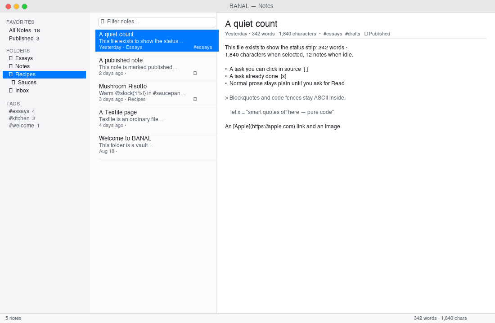
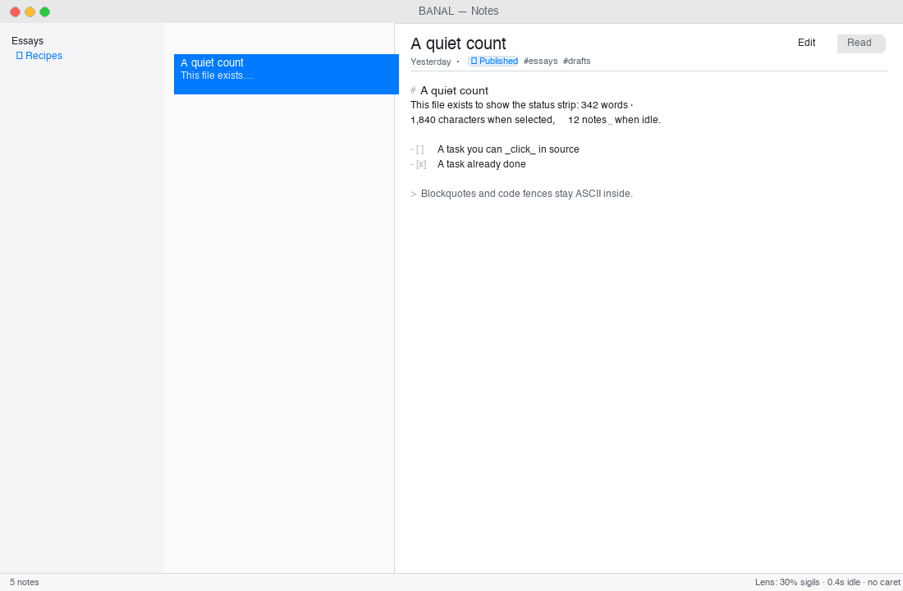
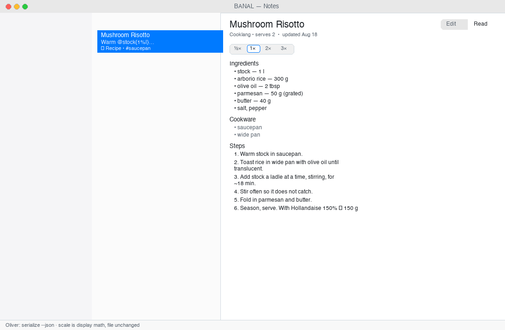
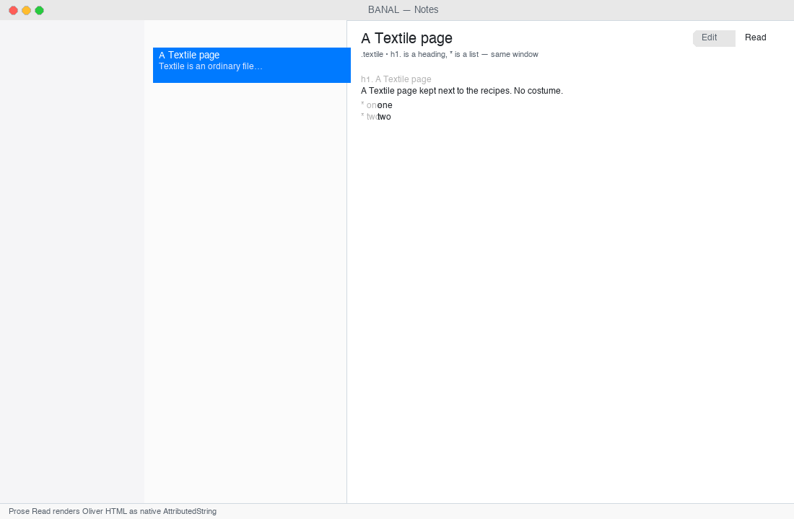
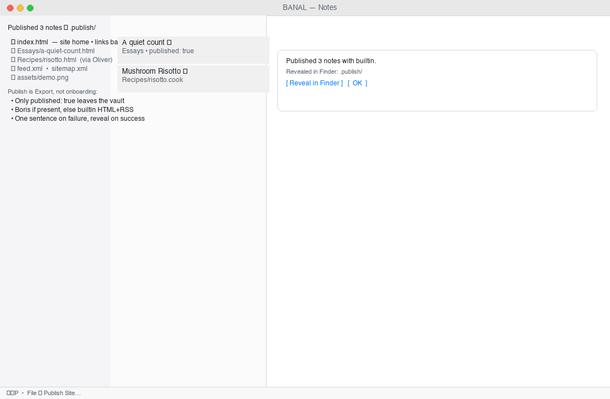
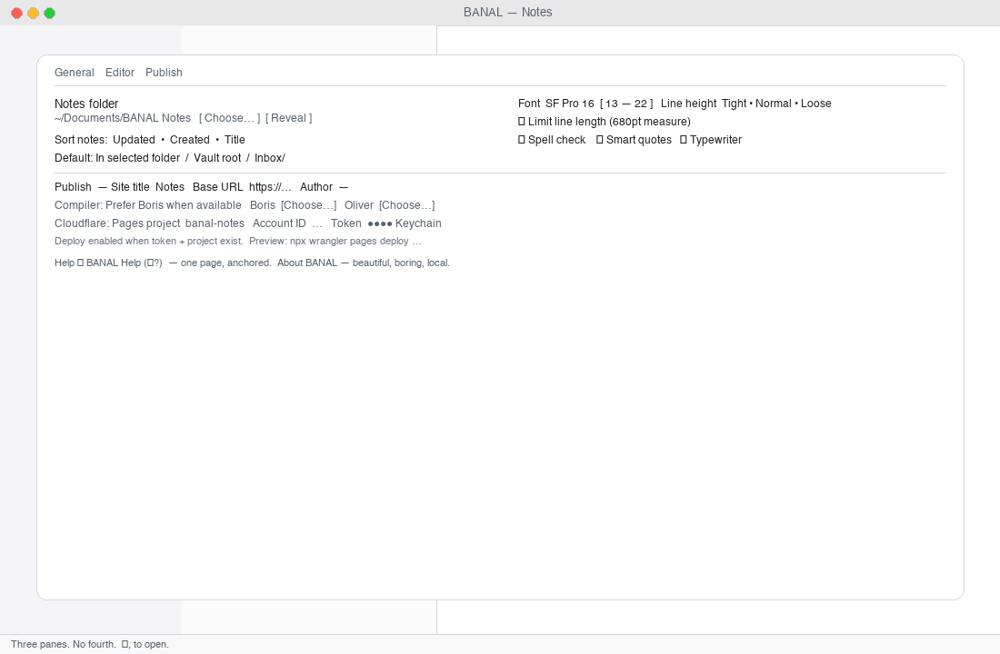
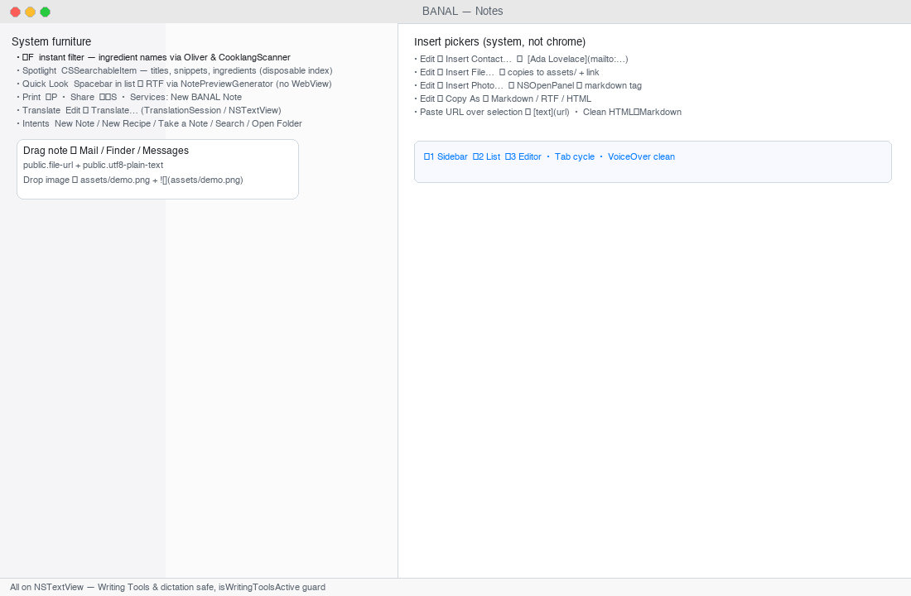
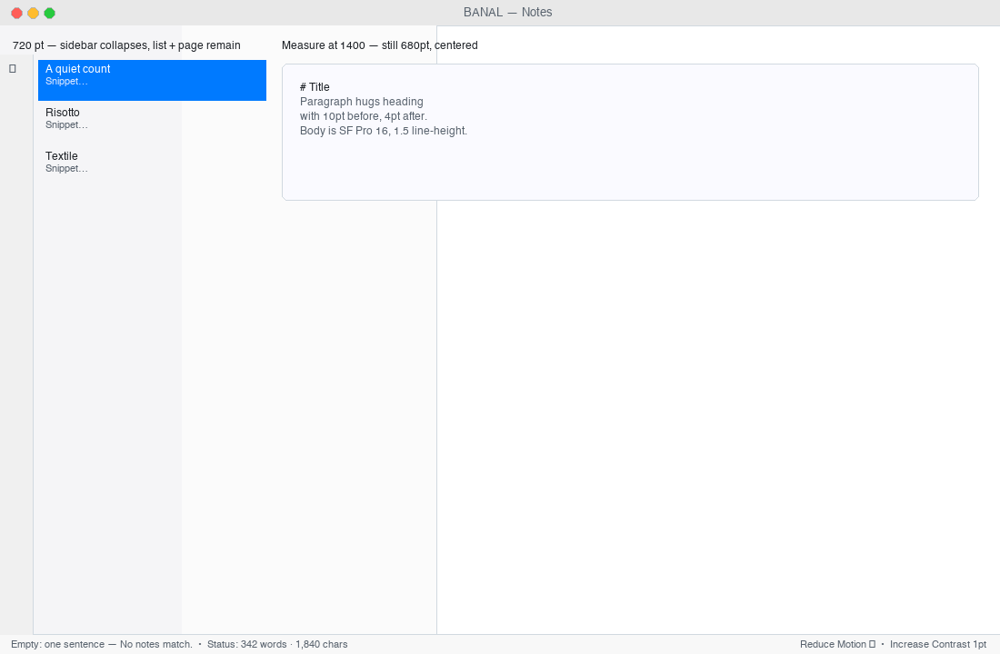
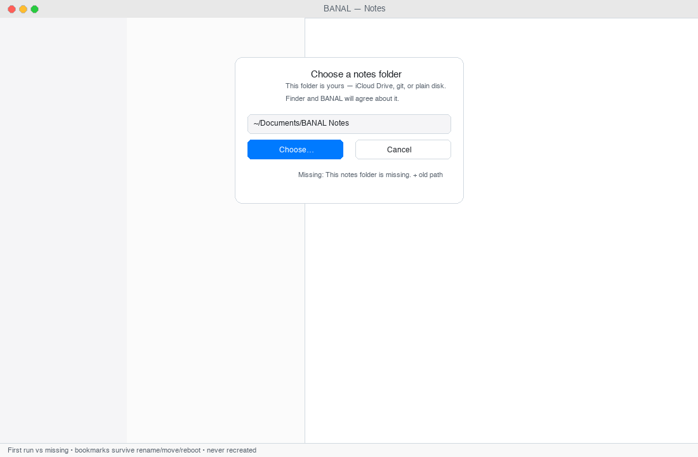

<div class="hero">

<p class="kicker">BANAL · Aug 2026 · Ad-hoc build · Free-tier</p>

# Notes in folders on disk — including recipes.

BANAL is a small, finished-looking Mac notes app. You pick a folder. You write Markdown, Textile, or Cooklang. You file notes into folders that are real directories. Publishing to a static site is Export, not onboarding. That is the whole product.

This tour is a single scroll through the window as it exists today — Tucson complete, Drive polished, California free-tier — with a rendering of each surface and a note on what it earns and what it could become.

</div>

<p class="small">Silhouette: Folders · List · Page. One type family. System accent only. If it is not in the menu bar, it is not a feature. This page was built with <a href="https://github.com/drawmeanelephant/boris">Boris</a> from a vault of plain files.</p>

---

## 1 · The whole window

Three columns, no extra chrome. Sidebar ~200 pt, list ~280 pt, editor takes the rest. Sidebar may collapse at 720 pt; list + editor stay. Type is SF Pro 16 pt with a 680 pt centered measure when **Limit line length** is on.

This is the bet: look simple, be fluent. Folders first, tags as a filter, languages as extensions.

<figure>



<figcaption><strong>01 — The whole window at ~1100×720.</strong> Left: All Notes / Published / nested folders + Tags filter (secondary). Middle: filtered list with title, two-line snippet, relative date, globe for published and bowl for recipes. Right: title, one quiet metadata row, body as a page. Status strip: note count when idle, word/char count when editing. Light and dark both look like the system.</figcaption>
</figure>

**What lands:** The default really is folders · list · page. No graph, no canvas, no AI pane, no dashboard. 720 and 1400 both read as a page; 1100 is the honest middle.

**Next noodle:** The silhouette is done. The only honest next is polish that keeps it the same size — not a fourth column. See §9.

---

## 2 · Sidebar — folders are directories

A folder is a `mkdir`. Create, rename, move, and trash are filesystem operations you can see in Finder. Empty folders stay. `Inbox/` is created only if the preference says so. `Reveal in Finder` is honest because the folder exists on disk.

Tags appear below the folders as a quiet secondary filter: unique strings from frontmatter (`#essays`, `#kitchen`), in memory, click to filter the list, click again to clear. No virtual notebooks, no graph UI.

<figure>


<figcaption>Same capture, left edge: <em>Favorites</em> (All Notes, Published), <em>Folders</em> as a real tree (Essays, Notes, Recipes/Sauces, Inbox), <em>Tags</em> below. Drag a note onto a folder to move the file. Rename in Finder → BANAL rescans via FSEvents + NSFilePresenter. No second database can disagree with disk.</figcaption>
</figure>

**What lands:** `FSEvents` coalescing, dirty-keep vs clean-reload, watch-off still catches vanish, empty folders survive, bookmarks survive rename/move/reboot, vanishing-while-open dumps to the picker with old path. All covered by the Drive (Casa Grande → Gila Bend) and `TESTING-*.md` briefs.

**Next noodle:** Nested drag with auto-expand on hover is small and kind. A tag count badge (muted) is fine. Tags-as-a-place is explicitly refused.

---

## 3 · List — title, snippet, time, globe

Each row: title, two-line frontmatter/body snippet, relative date, a quiet mark if `published: true` (globe), and a bowl for `.cook`. Recipe rows do not need a legend — the suffix and badge are enough.

Search is `⌘F` instant in memory. For `.cook` notes it also matches Oliver ingredient names and braced amounts — bare tokens, multi-word, and inlined sauces via `CooklangScanner` — with a disposable cache. No food ontology, no second index.

<figure>


<figcaption>Middle column: instant filter field, then five rows with their metadata. Search never waits on Oliver; Spotlight (`CSSearchableItem`) is a separate, throttled, disposable index for system-wide find.</figcaption>
</figure>

**What lands:** Sorting by updated/created/title, 5k-file cold open to first keystroke <400 ms, `⌘F` instant, Spotlight/Quick Look/Print all behave as Mac furniture.

**Next noodle:** A subtle published filter pill in the list header (beside the search, not a mode) would make the Published pseudo-folder redundant on small windows. Do not add a per-note color or pin.

---

## 4 · Editor — source stays king

Title field + one metadata row (date, published toggle, tags). Body is AppKit `NSTextView` / TextKit 2 — undo, find, spell, dictation, and system Writing Tools all participate because the view is stock.

Three production manners added in Tucson:

- **Whisper (D-1):** headings and sigils at ~30 % opacity with same metrics, via temporary attributes after 0.4 s idle. Not a theme. Writing Tools guard (`isWritingToolsActive`) prevents clobber.
- **List continuation (E-3):** Return continues `-`, `*`, `+`, `- [ ]`, `1.` with indentation; empty bullet breaks out to a plain paragraph; `⇧Return` is a soft break; code fences suppress continuation; `⌘Z` undoes in one step.
- **Smart paste (E-2):** URL over selection → `[selection](url)`; rich HTML from Safari/PDF → clean Markdown via Oliver; styles and spans stripped.

Punctuation discipline (E-4): smart quotes/dashes and spell are suppressed inside ``` fences, inline `` `code` ``, and Cooklang `>>` lines — ASCII in code, prose stays human.

<figure>



<figcaption><strong>02 — Editor in Edit.</strong> Title, Published toggle + tags, Edit | Read switcher. Body: <code>#</code>, <code>- [ ]</code>, <code>&gt;</code>, <code>_emphasis_</code> markers dimmed, text at full ink. Heading paragraph spacing hugs the paragraph (10 pt before, 4 pt after). Caret flush only when dirty; switch notes resets undo per note; clean external reload keeps a valid offset. Checked in source via <code>- [x]</code> click — a single character swap, <code>⌘Z</code> intact.</figcaption>
</figure>

**What lands:** The editor is always source. Preview, if it exists, is secondary and never replaces TextKit. Oliver is asked questions after idle; the caret never waits.

**Next noodle:** A 30-second type sit still closes the last gate. After that, the small refinement is `⌘D` duplicate-line if it is free from the text view — not multi-cursor as a product. Per-note fonts and focus-dimming are refused.

---

## 5 · Recipes — the reading view that earns its keep

`.cook` files are notes that happen to be dinner. Same folder, same list, same shortcut. Edit is always source (`>> title`, `@ingredient{qty%unit}`, `#cookware{}`, `~{timer}`). Read is Oliver's typed `Recipe`: ingredients (quantity + unit), cookware, numbered steps, notes, timing — with a display-only scale control (`½× · 1× · 2× · 3×`). The file on disk does not change unless you explicitly save a scaled copy.

Sauce references (`@./sauces/Hollandaise{150%g}`) stay as written on disk and are inlined under the hood for display and for search.

<figure>



<figcaption><strong>03 — Recipe Read.</strong> Edit | Read sits in the detail pane, not a new column. Scale is application math, not a rewrite. The one-sentence fallback <em>This recipe needs Oliver.</em> is the honest state when <code>serialize --json</code> is absent — Edit still works.</figcaption>
</figure>

This is where Textile and Markdown get their quiet sibling:

<figure>



<figcaption><strong>04 — Textile as an ordinary file.</strong> <code>.textile</code> with <code>h1.</code> and list syntax lives beside <code>.md</code> and <code>.cook</code>. New Textile / New Recipe are three items in <strong>File → New</strong>, not a platform. Prose Read (D-2) renders Oliver's HTML as a native <code>AttributedString</code> page on the same type — no WebView, no second editor.</figcaption>
</figure>

**What lands:** Oliver is the only parser. Swift never grows a second CommonMark. D-3 (sauce inlining) and D-4 (ingredient search) are landed — including braced and multi-word tokens.

**Next noodle:** Save a scaled copy is explicitly deferred until a cook asks. When it arrives: File → Save Scaled Copy… writes `Risotto (2×).cook` with quantities recomputed, source freshly generated, undoable. Do not add pantry, meal plan, aisle-sorted shopping lists, or NYT import.

---

## 6 · Publishing — Export, not onboarding

Mark notes Published (frontmatter `published: true`), then **File → Publish Site…** (`⇧⌘P`). Only published notes leave the vault. The compiler is **Boris** when present, otherwise a builtin HTML + `feed.xml` writer. Markdown through Boris, Textile and Cooklang via Oliver into the same `.publish/` folder. Recipes stay `.cook` on disk. The artifact is a folder of HTML you can open, archive, or deploy.

Cloudflare is a preference plus Keychain: `Pages project name` + `Account ID` travel with the vault in `.banal/config.json`; the API token lives only in Keychain (`dev.drawmeanelephant.banal`), never in the vault, prefs, or logs. Deploy is enabled when token + project exist; failure is one sentence, the log is copyable; success does not nag.

<figure>



<figcaption><strong>05 — Publishing as Export.</strong> Left browsers show the artifact: <code>index.html · Essays/ · Recipes/ · feed.xml · assets/</code>. The app shows one successful sentence: <em>Published 3 notes with builtin.</em> and a Reveal in Finder. Builtin HTML is a small subset — honest until Boris is the usual path. The local site never needs a token.</figcaption>
</figure>

**What lands:** File associations (F-8) — Open With / Dock drag / double-click for `.md` / `.textile` / `.cook`; inside vault opens in place, outside is copied into vault root byte-identical once (deduped `onOpenURL` + `application(_:open:)`). Press site and site checks pass.

**Next noodle:** Keep publishing boring. The two small wins are (a) a dry-run `wrangler.toml` preview that is copyable from Settings → Publish, and (b) a nicer builtin RSS when Boris is absent. No Worker dashboard, no R2 browser, no billing inside the app.

---

## 7 · Settings — three panes, same order

`⌘,` opens **General · Editor · Publish**. No fourth pane.

- **General:** Notes folder (bookmark with Reveal/Choose), sort, default new-note location, watch toggle.
- **Editor:** SF Pro, 13–22 pt, line height tight/normal/loose, limit line length, spell/smart quotes, typewriter (off by default).
- **Publish:** site identity (title, base URL, author), compiler toggles/paths, Cloudflare identity, token slot (Keychain only).

About and Help are the mission sentence and one Help Book page with anchored sections, not a site.

<figure>



<figcaption><strong>06 — Settings.</strong> Three panes. Validation is inline: base URL must be http/https, project name is Cloudflare-safe (<code>[a-z0-9-]</code>), account ID is hex-ish (warn, don't block), token never displayed after save. Cloning a vault carries identity, not secrets.</figcaption>
</figure>

**What lands:** Honest settings copy — “Notes folder” not vault, “Published notes” not public graph, “API token (Keychain)” not password, connected state as a sentence. Inline validation.

**Next noodle:** One written stylesheet pairing if it still feels like the system — not a theme store. Localization only after the English empties are sentences you'd say out loud.

---

## 8 · The system, not a product

Everything in this row is Mac furniture, not a BANAL product:

<figure>



<figcaption><strong>07 — System furniture.</strong> Spotlight finds titles/snippets/ingredients (index is disposable; disk is truth). Spacebar in the list opens a Quick Look RTF panel (SF Pro, no WebView) for <code>.md</code>/<code>.cook</code>/<code>.textile</code>. <code>⌘P</code> prints the visible page; Share shows <code>NSSharingServicePicker</code>; Services offers <em>New BANAL Note</em> from any selection. Translate is a system sheet. Siri/Shortcuts: New Note, New Recipe, Take a Note, Search, Open Notes Folder, Publish Site. Entitlements only when the picker that needs them ships.</figcaption>
</figure>

**What lands:**
- Images → `assets/` + relative `` with `-1`/`-2` collision, `⌘Z` intact, `isRichText` stays false.
- Import (File → Import… `⌘I`) copies external `.md`/`.textile`/`.cook` trees into the vault, converting `.txt` to `.md`, preserving collisions.
- File pickers: Insert Contact… (`CNContactPicker` → `[Name](mailto:tel:)`) and Insert File… (`NSOpenPanel` → copy to `assets/` + link).
- Drag out: list rows to Mail/Messages/Finder as `public.file-url` + `plain-text`; internal drag to folders moves the file.
- Copy As: Markdown / Rich Text (RTF) / HTML via `CopyAsConverter`.

**Next noodle:** `Insert Photo…` already exists for images. The only system refinement left is making VoiceOver on the Recipe Read announce “scaled 2×” without narrating the math.

---

## 9 · Sizes, motion, empties, and manners

<figure>



<figcaption><strong>08 — Widths and empties.</strong> At 720 the sidebar may collapse; the page stays a page. At 1400 the measure centers at ~680 pt when Limited. Empty states are one sentence: <em>No notes in this folder. · No notes match. · Nothing published.</em> Reduce Motion respects <code>accessibilityReduceMotion</code>; Increase Contrast renders 1 pt hairlines. Light and dark both look expensive, not branded.</figcaption>
</figure>

<figure>



<figcaption><strong>09 — The vault picker.</strong> First run: <em>Choose a notes folder.</em> Missing at launch or while open: <em>This notes folder is missing.</em> with the remembered path and the same two buttons — never silently recreates the vault. Missing behavior has its own brief (<code>TESTING-NOTES-FOLDER.md</code>). The picker copy is the product's first promise.</figcaption>
</figure>

**What lands:** Typography stays SF Pro; measure cap; line-height mapping; empty sentences; dirty-external and missing-vault states; window at 720/1100/1400 in light and dark; automated `performAccessibilityAudit` against the signed app (allowlisted only for platform-standard secondary text and system layout containers).

**Next noodle:** The remaining 1.0 copy is already landed — Help single page + About + empties + `CHANGELOG.md` at `1.0` — and will be re-read in the sit. What is still open is the human pass that closes the whole-window sit; everything that pass finds becomes one-card bugs in the Drive, not new chrome.

---

## 10 · Forward — what to noodle on next

The window is drawn. Publishing works offline. The interesting decisions are now about restraint and finish, not about adding surfaces.

Tucson before California is done. California free-tier ships ad-hoc; paid notarize + stapled (Developer ID) stays the honest 1.0. The next board before Japan is the Drive — one-card bugs per town — but the product question you can noodle on today is: where does a small AAA app still earn trust?

### Keep the silhouette — earn finish

| # | Idea | Shape that keeps three columns | Why it earns | Die if |
|---|------|-------------------------------|--------------|--------|
| 1 | **Quiet polish pass** | No new pane, no new column. Sub-pixel type, hairlines, selection, empties re-read aloud. | Makes the window feel like Apple shipped it. | It needs a tour to explain. |
| 2 | **Whisper tuning** | 30 % dimming → 28–35 % sweep with the caret; heading hug stays 10/4, not theme. | Source stays source, hints stay hints. | It becomes syntax coloring. |
| 3 | **One stylesheet** | Single global typographic pairing beyond raw SF if we must — still system-honest. | Depth without a marketplace. | Per-note fonts, serif-as-personality, themes named after cities. |
| 4 | **Typewriter, off** | Pref exists, default off; fix only if it is free from the text view. | Keeps the caret predictable. | It moves the page when the user didn't ask. |
| 5 | **Browse Previous Versions** | File → Browse Previous Versions if macOS Versions is cheap. No home-grown time-machine scrubber. | History without a second database. | A custom scrubber, SwiftData history, CloudKit vault sync. |
| 6 | **Save a scaled recipe copy** | When a cook asks: File → Save Scaled Copy… writes `Risotto (2×).cook`. Display math today is correct. | Honors the file; honors the kitchen. | Pantry, meal calendar, aisle-sorted grocery, NYT import. |
| 7 | **Enrich Markup / Suggest Title** | Menu, undoable, never auto. On-device Foundation Models or a user binary on a path; silent if absent; `#available`. | Local help that never waits on a vendor. | AI pane, chat with notes, RAG HUD, backlinks graph, wikilinks. |
| 8 | **Finder fidelity** | Reveal after Finder rename is landed; keep the next beat: badge the old path until the bookmark refreshes, right-click a folder → Move to Trash for real. | Disk and UI never disagree. | Recreate a vanished folder because it is easier. |
| 9 | **Import as copy, deeper** | Keep copying trees; add `.textile` → `.md` when the user explicitly converts, not on open. | The folder is the sync story (iCloud Drive / syncthing / git). | Live sync from Notion/Obsidian OAuth, hosted vault service. |
| 10 | **Publishing, still Export** | Keep builtin HTML honest; preview `wrangler.toml` copyable in Settings; optional custom domain sentence. | Feels like Export, not onboarding a SaaS. | Worker/R2 dashboard, multi-tenant host, billing, OAuth dance. |

### What not to add — the refuse that keeps it small

- Graph UI, backlinks map, wikilinks, daily-note ritual, plugins/middleware.
- Solipsist Compose / inspector / companions (Oliver+Boris are engines, not chrome).
- WKWebView as the editor, render-swap rich text, outline gutter, Mermaid/live LaTeX/admonition tinting, image full-bleed-library, focus/paragraph dimming, menu-bar scratchpad.
- Fourth Settings pane, hosted sync of our own, Worker/R2 browser, subscription gate on local notes, AI-first chat.

If an idea would make the default window wider than folders · list · page, make dinner and a paragraph feel like two products, or require the network to write — it is a wrong exit. The navigator list for that is `HOPE-CHEST.md`'s Louisiana.

### If you are shopping this around

- **For a writer:** open the folder in Vim after a month. The paragraph is still just `---` frontmatter + Markdown. No export, no migration lab required.
- **For a cook:** keep `.cook` next to essays. Open it Thursday, scale to six in Read, cook. Friday the same file opens unchanged in Finder.
- **For a publisher:** mark three notes Published → `⇧⌘P` → inspect `.publish/` and `feed.xml`. If `boris` is on PATH the artifact is a validated site; without it, the builtin is honest HTML you can hand to any static host. Credentials never leave Keychain.
- **For a skeptic:** resize to 720, flip to dark, hold VoiceOver on. Resize to 1400, toggle Limit line length. Trash a folder in Finder while the app is open and watch the picker keep its promise.

---

## 11 · How to keep score

| Test | Pass |
|------|------|
| New user writes in 5 min with no explanation | Silhouette test — `TESTING-WINDOW.md` §1–3 |
| Finder and BANAL agree on disk | Vault bookmark + FSEvents + trash truth |
| Recipes and essays share the same window | Same list, same shortcut, same folder |
| Local notes never need a token | Cloudflare unset → still write, search, file |
| A stranger double-clicks and keeps it | Free-tier today (right-click Open), paid after `Developer ID Application` |
| Left open for a week, caret where left | No second DB, atomic 0.4 s saves, per-note `NSUndoManager` |

The board that was closed for this tour:

- `M9 Type` · `M10 System` · `M11 Files` · `M12 Consider` — all landed (issues 37–40 · 25–36 · 32–36 closed).
- Drive `M13 Casa Grande` → `M19 Quartzsite` — stability triage landed on `fix/j13`…`j19` branches (bookmark, FSEvents, atomic save, latency, a11y, UTType/Quick Look/Print, copy/help) — each with its `Tests/` gate.
- `M20 California` free-tier — ad-hoc `dist/BANAL.app` (`-` / Apple Development `ZQT4XUHVT5`) ships via right-click Open; `M20 paid` (notarized + stapled, `spctl --assess`) and the whole-window release sit (`I-2`) demoted to `M99 Home` for now — stupid-finishing is a no-brainer + free-tier already installable, so the board is cleared for the next improvements.

---

## 12 · Credits

BANAL · Swift 6 · `@MainActor` store · atomic `NoteIO` writes · `BANALCore` / `BANALApp` / `BANALPublisher` — [github.com/drawmeanelephant/banal](https://github.com/drawmeanelephant/banal) · Built at `1.0 (1.0)` · Boris `src/graph` + Oliver `serialize/scale` underneath, neither owning the window.
